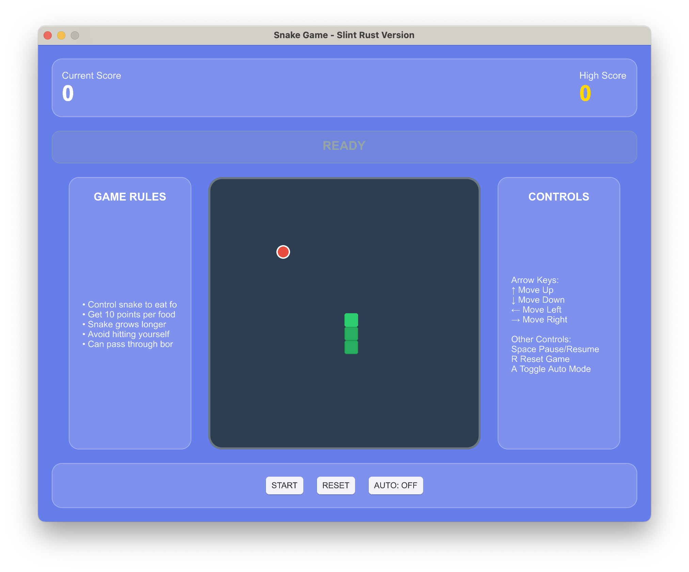

# Snake Game - Slint Rust Version

A classic snake game developed using [Slint](https://slint.rs/) and Rust.

## Game Features

- 🐍 Classic snake gameplay
- 🎮 Support for keyboard and mouse controls
- 📊 Real-time score and high score tracking
- ⏸️ Pause/Resume functionality
- 🔄 One-click game reset
- 🎨 Modern user interface

## Screenshot




## Game Controls

### Keyboard Controls
- **↑**: Move Up
- **↓**: Move Down
- **←**: Move Left
- **→**: Move Right
- **Space**: Pause/Resume game
- **R**: Reset game

### Mouse Controls
- Click direction buttons to control snake movement
- Click "Start/Pause" button to control game state
- Click "Reset" button to restart the game

## Game Rules

1. Control the snake to eat red food
2. Each food eaten increases the snake's length and adds 10 points
3. Avoid hitting your own body, or the game ends
4. The snake can pass through borders to reach the opposite side
5. Challenge for higher scores!

## Installation and Running


### Desktop Version

#### Quick Start

1. Clone or download the project:
   ```bash
   git clone https://github.com/timsaya/snake-game
   cd snake-game
   ```

2. Build and run:
   ```bash
   cargo run --release
   ```

#### Features
- **Native performance**: Optimized for desktop platforms
- **Full keyboard support**: Arrow keys, space, R key
- **High-quality rendering**: Native UI components
- **Offline play**: No internet connection required

### WebAssembly (WASM) Version


#### Quick Start

1. 
   Install `wasm-bindgen-cli`:
   ```bash
   cargo install wasm-bindgen-cli
   ```

2. Build WASM target:
   ```bash
   wasm-pack build --release --target web
   ```

3. Start web server:
   ```bash
   python3 -m http.server 8080
   ```

4. Open browser: `http://localhost:8080`

#### Features
- **Cross-platform**: Runs in any modern web browser
- **No installation**: Play directly in browser
- **Mobile friendly**: Works on desktop and mobile devices
- **Same gameplay**: Identical features to desktop version

#### Browser Support
- Chrome 57+, Firefox 52+, Safari 11+, Edge 79+

#### Troubleshooting
- Ensure browser supports WebAssembly
- Check web server is running correctly
- Verify `pkg/` directory files are accessible
- Clear browser cache if needed


## Contributing

Welcome to submit Issues and Pull Requests to improve this game!

## License

MIT License - See [LICENSE](LICENSE) file for details

## About Slint

Slint is a toolkit for developing embedded user interfaces. It provides:
- Declarative UI language
- Seamless integration with Rust
- High-performance rendering
- Cross-platform support

For more information, visit the [Slint official website](https://slint.rs/).
